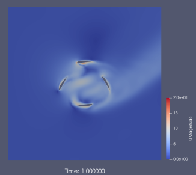

# cyclorotor
The case file cycloid simulates a 4-bladed cyclorotor in OpenFOAM v2406. Before processing a case file, set the number of parallels according to the specifications of your computer.  

gen6DoF generates orbit data for each rotor. graph folder contains graph display scripts for GNU Octave.  

